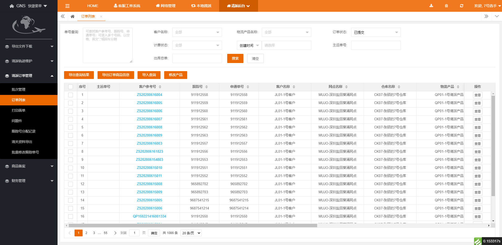

> # GNS前端页面结构效果概览

1.常见页面结构效果图



2.页面HTML结构

```
<html>
    <head>
        <meta charset="UTF-8" />
    </head>
    <body>
        <div class="layui-fluid layui-fluid-100">
            <div class="layui-card layui-card-h100">
                <div class="layui-card-body">
                    <!-- 表单区域 -->
                    <form class="layui-form">
                        <!-- 搜索条件 -->
                        <div class="layui-form-item"></div>
                        <!-- 分割线 -->
                        <div class="cut-line"></div>
                        <!-- 按钮操作 如果不需要分割线 则 不用加 mt15 类-->
                        <div class="layui-form-item mt15"></div>
                    </form>
                    <!-- 表单区域结束 -->
                    <!-- 数据表格区域 -->
                    <div>
                        <table></table>
                    </div>
                    <!-- 数据表格区域结束 -->
                </div>
            </div>
        </div>
    </body>
</html>
```

3.按钮类型

3.1 主按钮-->高35px类-->layui-btn-h35;

3.2 次按钮-->高35px类-->layui-btn-minor-h35;

3.3 主按钮-->高30px类-->layui-btn-h30;

3.4 次按钮-->高30px类-->layui-btn-minor-h30;

3.5 次按钮-->高25px类-->layui-btn-minor-h25;

4.常用类

4.1 距离上边15px类 mt15;

4.2 距离上边-15px类 mt-15;


